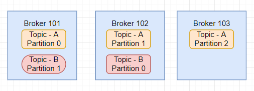
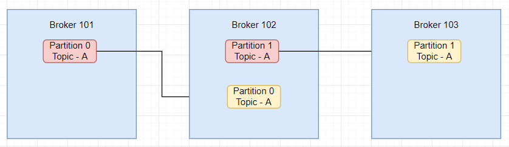
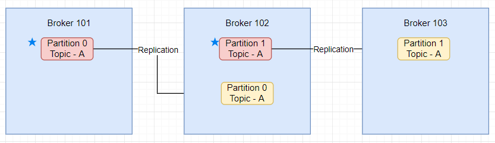

# Kafka

## Topics, Partitions and Offsets

`Topics: A particular stream of data`
 * Similar to a table of the database
 * You can have as many topics you can
 * A topic is identified by its name   

`Topics are split in partitions`
 * Each partition is ordered 
 * Each message in partition will get an incremental ID called offset
 * Partition 0, 1, 2 ....
 * Order only guaranteed within a partition, not across partitions
 * Data is kept only for a limited time.
 * Once the data is written to a partition it cannot be changed.

Example Scenario :
You can have multiple cabs, and each cabs reports its GPS location to kafka.
You can have a topic cabs_gps that contains the position of all cabs.
Each cab will send a message to kafka every 20 sec, each message will contain the cabID, and the cab location(lat/long)

## Brokers & Topics

 * A kafka cluster is composed of multiple brokers(servers)
 * Each broker is identified by its ID(integer)
 * Each broker contains certain topic partitions
 * After connecting to any broker(called a bootstrap broker), you will be connected to the entire cluster
 * A good number to get start is 3 brokers, but some big clusters have more than 100 brokers
   
Example of topic A with 3 partitions   
Example of topic B with 2 partitions   

## Topics replication

 * Topics should have a replication factor >1 (Usually between 2 and 3)
 * This way if one broker is down another broker can serve the data.
Example of topic A with replication factor 2

   
 * At any time only ONE broker can be a leader for a given partition
 * Only that leader can receive and serve data for a partition.
 * The other broker will synchronize the data.
 * So each partition has one leader and multiple ISR (in-sync-replica)
 